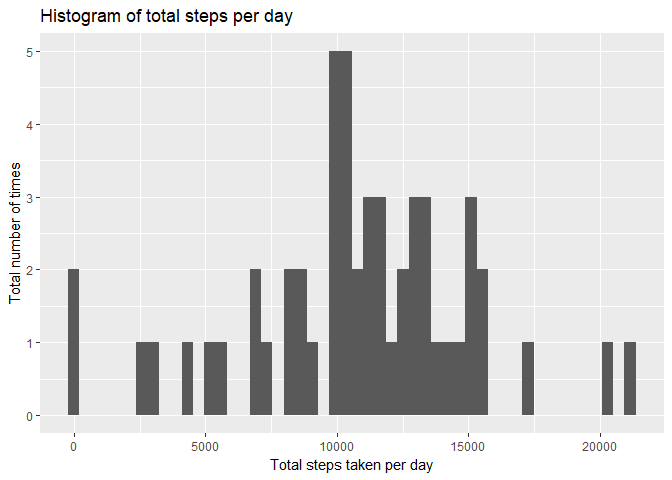
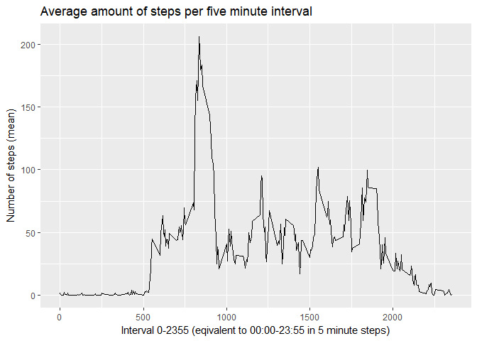
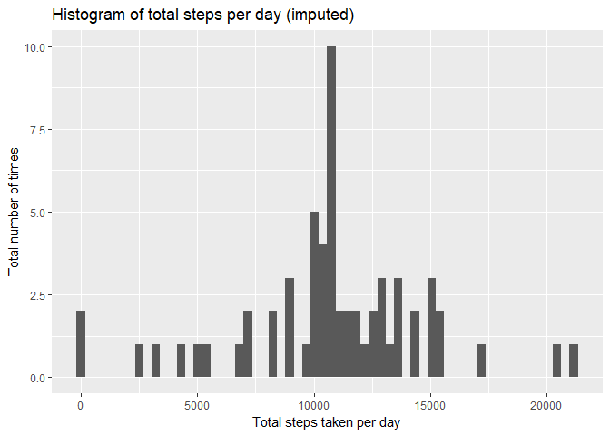
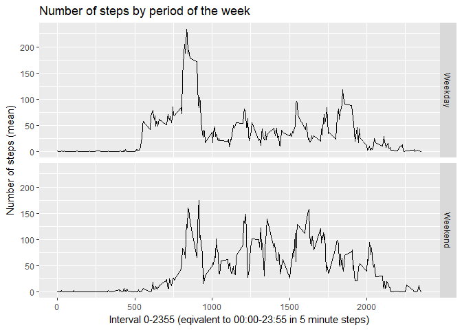

# Reproducible Research: Peer Assessment 1


###  Prepare Data

```r
if(!file.exists('activity.csv')){
unzip('activity.zip')
}
```


```r
#Read in data        
activity <- read.csv("activity.csv", header = TRUE, sep = ",")        
```


```r
#Declare as date
activity[,2] <- as.Date(activity[,2])
```


### Question 1: What is mean total number of steps taken per day?

```r
total_steps_per_day <- aggregate(activity$steps, by=list(activity$date), FUN=sum)
total_steps_per_day <- rename(total_steps_per_day, c("x"="steps_day"))
head(total_steps_per_day)        
```

```
##      Group.1 steps_day
## 1 2012-10-01        NA
## 2 2012-10-02       126
## 3 2012-10-03     11352
## 4 2012-10-04     12116
## 5 2012-10-05     13294
## 6 2012-10-06     15420
```
        
#### Question 2: Make a histogram of the total number of steps taken each day

```r
with(activity, qplot(tapply(steps, date, sum),
                     bins=50,
                     main = "Histogram of total steps per day",
                     xlab = "Total steps taken per day",
                     ylab = "Total number of times",
                na.rm=TRUE
                ))
```

<!-- -->

### Question 3: Calculate and report the mean and median of the total number of steps taken per day

```r
#Calculation of mean steps per day
mean(tapply(activity$steps, activity$date, sum), na.rm = TRUE)
```

```
## [1] 10766.19
```


```r
#Calculation of median steps per day
median(tapply(activity$steps, activity$date, sum), na.rm = TRUE)
```

```
## [1] 10765
```
     
        
        
        

### What is the average daily activity pattern?

### Question 1: Make a time series plot (i.e. type = "l") of the 5-minute interval (x-axis) and the average number of steps taken, averaged across all days (y-axis)


```r
#Calculate Mean
mean_steps_by_interval <- aggregate(activity$steps, by=list(activity$interval), FUN=mean, na.rm=TRUE)
head(mean_steps_by_interval)
```

```
##   Group.1         x
## 1       0 1.7169811
## 2       5 0.3396226
## 3      10 0.1320755
## 4      15 0.1509434
## 5      20 0.0754717
## 6      25 2.0943396
```

```r
#Transform factor into integer so the x axis is displayed properly
mean_steps_by_interval[,1] <- as.integer(mean_steps_by_interval[,1])
#Rename variables
mean_steps_by_interval <- rename(mean_steps_by_interval, c("Group.1"="Interval","x"="Mean"))
#Plot
g <- ggplot(mean_steps_by_interval, aes(Interval, Mean))
g + geom_line(aes()) +
        labs(x= "Interval 0-2355 (eqivalent to 00:00-23:55 in 5 minute steps)",
             y= "Number of steps (mean)", 
             title="Average amount of steps per five minute interval")
```

<!-- -->


### Question 2: Which 5-minute interval, on average across all the days in the dataset, contains the maximum number of steps?

```r
interval_max <- aggregate(activity$steps, by=list(activity$interval), FUN=mean, na.rm=TRUE)
interval_max <- rename(interval_max, c("Group.1"="Interval","x"="Max"))
interval_max[which.max(interval_max$Max), ]
```

```
##     Interval      Max
## 104      835 206.1698
```


### Imputing missing values

### Question 1: Calculate and report the total number of missing values in the dataset (i.e. the total number of rows with NAs)

```r
sum(is.na(activity))
```

```
## [1] 2304
```


### Question 2 Devise a strategy for filling in all of the missing values in the dataset. The strategy does not need to be sophisticated. 
Calculate the mean across the entire column and fill it in all NA
        


### Question 3: Create a new dataset that is equal to the original dataset but with the missing data filled in.

```r
#Count the number of NAs
sum(is.na(activity))
```

```
## [1] 2304
```

```r
#Create a new dataset
activity_imputed <- activity
#Fill the NAs with the mean of the entire column
activity_imputed[is.na(activity_imputed$steps),1] <- mean(activity_imputed$steps, na.rm = TRUE)
#Check if it worked
sum(is.na(activity_imputed))
```

```
## [1] 0
```


### Question 4: Make a histogram of the total number of steps taken each day and Calculate and report the mean and median total number of steps taken per day. Do these values differ from the estimates from the first part of the assignment? What is the impact of imputing missing data on the estimates of the total daily number of steps?

```r
###Histogram of the total number of steps taken each day
total_steps_day <- aggregate(activity_imputed$steps, by=list(activity$date), FUN="sum")
qplot(total_steps_day$x, bins=60,
      main = "Histogram of total steps per day (imputed)",
      xlab = "Total steps taken per day",
      ylab = "Total number of times",
      na.rm=TRUE)
```

<!-- -->

```r
#Calculation of mean steps per day
mean_steps_per_day <- aggregate(activity_imputed$steps, by=list(activity_imputed$date), FUN=sum, na.rm=TRUE)
mean(mean_steps_per_day$x)
```

```
## [1] 10766.19
```

```r
#Calculation of median steps per day
median_steps_per_day <- aggregate(activity_imputed$steps, by=list(activity_imputed$date), FUN=sum, na.rm=TRUE)
median(mean_steps_per_day$x)
```

```
## [1] 10766.19
```

```r
#Comparison
#Mean: No difference
mean(tapply(activity$steps, activity$date, sum), na.rm = TRUE)
```

```
## [1] 10766.19
```

```r
mean(mean_steps_per_day$x)
```

```
## [1] 10766.19
```

```r
#Meidan: No difference
median(tapply(activity$steps, activity$date, sum), na.rm = TRUE)
```

```
## [1] 10765
```

```r
median(mean_steps_per_day$x)
```

```
## [1] 10766.19
```


             
### Are there differences in activity patterns between weekdays and weekends?

### Question 1: Create a new factor variable in the dataset with two levels – “weekday” and “weekend” indicating whether a given date is a weekday or weekend day.

```r
#Read in Data
activity <- read.csv("activity.csv", header = TRUE, sep = ",")
activity[,2] <- as.Date(activity[,2])
activity_imputed <- activity

# Transform
activity_imputed[,4] <-  weekdays(activity_imputed$date, abbreviate = FALSE)
activity_imputed <- rename(activity_imputed, c("V4"="Day"))
activity_imputed[,4] <- gsub("Montag",     "Weekday", activity_imputed$Day)
activity_imputed[,4] <- gsub("Dienstag",   "Weekday", activity_imputed$Day)
activity_imputed[,4] <- gsub("Mittwoch",   "Weekday", activity_imputed$Day)
activity_imputed[,4] <- gsub("Donnerstag", "Weekday", activity_imputed$Day)
activity_imputed[,4] <- gsub("Freitag",    "Weekday", activity_imputed$Day)
activity_imputed[,4] <- gsub("Samstag",    "Weekend", activity_imputed$Day)
activity_imputed[,4] <- gsub("Sonntag",    "Weekend", activity_imputed$Day)
activity_imputed[,4] <- as.factor(activity_imputed[,4])
table(activity_imputed$Day)
```

```
## 
## Weekday Weekend 
##   12960    4608
```

```r
head(activity_imputed)
```

```
##   steps       date interval     Day
## 1    NA 2012-10-01        0 Weekday
## 2    NA 2012-10-01        5 Weekday
## 3    NA 2012-10-01       10 Weekday
## 4    NA 2012-10-01       15 Weekday
## 5    NA 2012-10-01       20 Weekday
## 6    NA 2012-10-01       25 Weekday
```


### Question 2. Make a panel plot containing a time series plot (i.e. type = "l") of the 5-minute interval (x-axis) and the average number of 
        steps taken, averaged across all weekday days or weekend days (y-axis). See the README file in the GitHub repository to 
        see an example of what this plot should look like using simulated data.

```r
activity_imputed_weekday     <- aggregate(steps~interval + Day, FUN=mean, data = activity_imputed)
g <- ggplot(data=activity_imputed_weekday, aes(interval, steps))
g + geom_line() +
        facet_grid(Day~.) +
        labs(x="Interval 0-2355 (eqivalent to 00:00-23:55 in 5 minute steps)",
             y="Number of steps (mean)",
             title="Number of steps by period of the week")
```

<!-- -->
END
